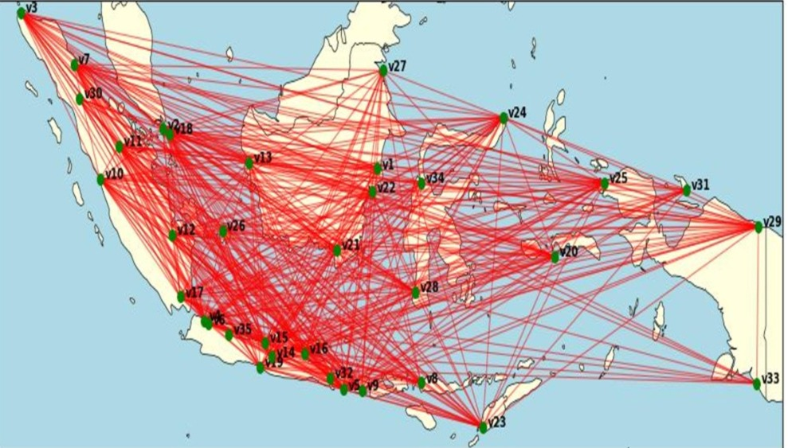

# ✈️ Flight Network Analysis

### Centrality and Resilience Analysis of Indonesia's International Airport Network Using Weighted Laplacian Energy Centrality (WLEC)

## Research Overview

Transportasi udara memiliki peran penting dalam menghubungkan berbagai wilayah, terutama di Indonesia yang terdiri dari banyak pulau. Selain membantu masyarakat bepergian dengan lebih cepat, jaringan penerbangan juga mendukung aktivitas ekonomi, pariwisata, distribusi barang, hingga pengembangan bisnis antarwilayah. Namun, jaringan penerbangan memiliki karakteristik saling terhubung dan bergantung satu sama lain. Ketika sebuah bandara mengalami gangguan, misalnya akibat kebakaran hutan dan asap, erupsi gunung yang menghasilkan abu vulkanik, atau kondisi lain yang menyebabkan bandara harus ditutup, dampaknya dapat meluas ke bagian lain dari jaringan penerbangan. Hal tersebut menimbulkan pertanyaan:

> **Seberapa penting peran masing-masing bandara dalam suatu jaringan penerbangan, dan seberapa besar perubahan jaringan apabila salah satu bandara mengalami gangguan atau harus ditutup?**

Dalam penelitian ini, bandara direpresentasikan sebagai *node*, sedangkan hubungan penerbangan antarbandara direpresentasikan sebagai *edge*. Bobot pada setiap hubungan ditentukan berdasarkan jumlah maskapai yang menyediakan layanan pada rute tersebut, sehingga rute dengan lebih banyak penyedia layanan memiliki bobot yang lebih besar. Analisis dilakukan menggunakan **Weighted Laplacian Energy Centrality (WLEC)** dan simulasi penghapusan bandara untuk menganalisis perubahan struktur dan ketahanan jaringan.

---

## 🔍 Key Findings

### 1. Bandara dengan Centrality Tertinggi

Hasil analisis WLEC menunjukkan beberapa bandara dengan nilai centrality tertinggi, yaitu:

1. CGK — Soekarno-Hatta
2. KNO — Kualanamu
3. DPS — I Gusti Ngurah Rai
4. PKU — Sultan Syarif Kasim II
5. BPN — Sultan Aji Muhammad Sulaiman

Bandara-bandara tersebut menunjukkan peran yang relatif besar dalam struktur jaringan berdasarkan nilai WLEC. Sebaliknya, beberapa bandara seperti **KJT, BWX, dan MKQ** memiliki nilai WLEC yang lebih rendah.

### 2. Peran Bandara Tidak Selalu Sama

Analisis penghapusan node menunjukkan bahwa setiap bandara memiliki peran yang berbeda dalam mempertahankan struktur jaringan. **BPN dan CGK** menunjukkan peran yang dominan dalam aspek konektivitas global jaringan. Sementara itu, **MDC** lebih dominan dalam mempertahankan konektivitas lokal antarbandara dalam kelompok jaringan yang terhubung dengannya. Hal ini menunjukkan bahwa pentingnya suatu bandara tidak hanya dapat dilihat dari jumlah koneksi, tetapi juga dari posisi dan hubungan bandara tersebut di dalam keseluruhan jaringan.

### 3. CGK Berperan dalam Efisiensi Jaringan

Penghapusan **CGK** menunjukkan perubahan yang relatif penting terhadap efisiensi jaringan, khususnya dalam mempertahankan jarak lintasan rata-rata (*average path length*).
Hal ini menunjukkan bahwa posisi CGK dalam jaringan memiliki keterkaitan dengan bagaimana bandara-bandara lain terhubung melalui jaringan penerbangan.

### 4. Jaringan Menunjukkan Ketahanan terhadap Gangguan Tunggal

Meskipun beberapa bandara memiliki tingkat centrality yang tinggi, penghapusan satu node secara umum menghasilkan perubahan metrik jaringan yang relatif kecil. Hasil simulasi menunjukkan bahwa jaringan penerbangan memiliki **tingkat ketahanan yang relatif tinggi terhadap gangguan tunggal**. Dengan kata lain, gangguan pada satu bandara tidak secara langsung menyebabkan perubahan besar pada keseluruhan struktur jaringan.

---

## Tools & Technologies

- **Python**
- **Network Analysis**
- **Graph Theory**
- **Weighted Graph**
- **Data Analysis**
- **Mathematical Modeling**
- **Weighted Laplacian Energy Centrality (WLEC)**
